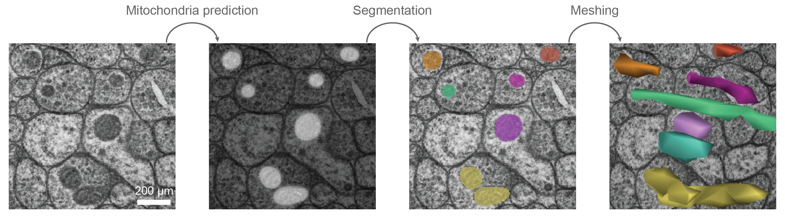

# Cmito: Mitochondria detection in *C*. *elegans* EM images

*Cmito* is a tool that enables dense reconstruction of mitochondria in *C*. *elegans* electron microscopy (EM) image stacks using convolutional neural network (CNN).

## Setup
```
# Clone repository
git clone https://github.com/jabae/Cmito.git
cd Cmito

# Install requirements
pip install -r requirements
```

## *Cmito* pipeline


### Mitochondria prediction
```
python Cmito/detect_nucleus.py --image [test_data/test_image.png] --model [models/nucleus_model.chkpt] --output [output_path.tif]
```
- Supports image files in tif, png, h5, cloudvolume images.

#### Mitochondria prediction models
- `models/dataset2_model25000.chkpt`: Trained on EM images from Witvliet et al. (2021)[^1] Dataset 2. 
- `models/dataset5_model104000.chkpt`: Trained on EM images from Witvliet et al. (2021)[^1] Dataset 5. 
- `models/dataset6_model166000.chkpt`: Trained on EM images from Witvliet et al. (2021)[^1] Dataset 6. 
- `models/dataset8_model122000.chkpt`: Trained on EM images from Witvliet et al. (2021)[^1] Dataset 8. 
- `models/dauer_model188000.chkpt`: Trained on EM images from Yim et al. (2021)[^2] dauer dataset.

*Select appropriate model that your image is similar to the images each model has been trained on.

### Mitochondria segmentation
```
python Cmito/segment_nucleus.py --mito [test_data/test_mito.tif] --output [output_path.tif]
```
- Supports image files in tif, png, h5, cloudvolume images.

*[ ] are variables users can specify. Currently, the variables point to the test data.

## Mitochondria reconstructions

| Stage    | Link to reconstructions  | Source |
|----------|--------------------------|--------|
| L1       | [L1 reconstructions](https://neuroglancer.bossdb.io/#!%7B%22dimensions%22:%7B%22x%22:%5B6.39999986e-10%2C%22m%22%5D%2C%22y%22:%5B6.39999986e-10%2C%22m%22%5D%2C%22z%22:%5B5e-8%2C%22m%22%5D%7D%2C%22position%22:%5B17315.146484375%2C18273.119140625%2C143.5%5D%2C%22crossSectionScale%22:33.669292188232546%2C%22projectionOrientation%22:%5B-0.7071067690849304%2C0%2C0%2C0.7071067690849304%5D%2C%22projectionScale%22:12557.325079997812%2C%22layers%22:%5B%7B%22type%22:%22image%22%2C%22source%22:%7B%22url%22:%22precomputed://s3://bossdb-open-data/witvliet2020/Dataset_2/em%22%2C%22transform%22:%7B%22matrix%22:%5B%5B-0.707%2C0.707%2C0%2C18824%5D%2C%5B-0.707%2C-0.707%2C0%2C34389%5D%2C%5B0%2C0%2C1%2C0%5D%5D%2C%22outputDimensions%22:%7B%22x%22:%5B6.39999986e-10%2C%22m%22%5D%2C%22y%22:%5B6.39999986e-10%2C%22m%22%5D%2C%22z%22:%5B5e-8%2C%22m%22%5D%7D%7D%7D%2C%22tab%22:%22source%22%2C%22name%22:%22Dataset_2%22%7D%2C%7B%22type%22:%22segmentation%22%2C%22source%22:%7B%22url%22:%22precomputed://s3://bossdb-open-data/witvliet2020/Dataset_2_Segmentation/segmentation%22%2C%22transform%22:%7B%22matrix%22:%5B%5B-0.707%2C0.707%2C0%2C18824%5D%2C%5B-0.707%2C-0.707%2C0%2C34389%5D%2C%5B0%2C0%2C1%2C0%5D%5D%2C%22outputDimensions%22:%7B%22x%22:%5B6.39999986e-10%2C%22m%22%5D%2C%22y%22:%5B6.39999986e-10%2C%22m%22%5D%2C%22z%22:%5B5e-8%2C%22m%22%5D%7D%7D%7D%2C%22tab%22:%22source%22%2C%22segments%22:%5B%22139%22%2C%22164%22%2C%22165%22%2C%2230%22%2C%2245%22%2C%2261%22%2C%228%22%5D%2C%22name%22:%22segmentation%22%7D%2C%7B%22type%22:%22segmentation%22%2C%22source%22:%7B%22url%22:%22precomputed://s3://bossdb-open-data/witvliet2020/Dataset_2_Segmentation/synapses%22%2C%22transform%22:%7B%22matrix%22:%5B%5B-0.707%2C0.707%2C0%2C18824%5D%2C%5B-0.707%2C-0.707%2C0%2C34389%5D%2C%5B0%2C0%2C1%2C0%5D%5D%2C%22outputDimensions%22:%7B%22x%22:%5B6.39999986e-10%2C%22m%22%5D%2C%22y%22:%5B6.39999986e-10%2C%22m%22%5D%2C%22z%22:%5B5e-8%2C%22m%22%5D%7D%7D%7D%2C%22tab%22:%22source%22%2C%22segments%22:%5B%5D%2C%22name%22:%22synapses%22%7D%2C%7B%22type%22:%22segmentation%22%2C%22source%22:%7B%22url%22:%22precomputed://https://s3.amazonaws.com/bossdb-open-data/mesh/witvliet2020/Dataset_2_Mesh%22%2C%22transform%22:%7B%22matrix%22:%5B%5B-0.707%2C0.707%2C0%2C18824%5D%2C%5B-0.707%2C-0.707%2C0%2C34389%5D%2C%5B0%2C0%2C1%2C0%5D%5D%2C%22outputDimensions%22:%7B%22x%22:%5B6.39999986e-10%2C%22m%22%5D%2C%22y%22:%5B6.39999986e-10%2C%22m%22%5D%2C%22z%22:%5B5e-8%2C%22m%22%5D%7D%7D%7D%2C%22tab%22:%22source%22%2C%22linkedSegmentationGroup%22:%22segmentation%22%2C%22name%22:%22Dataset_2_Mesh%22%7D%2C%7B%22type%22:%22segmentation%22%2C%22source%22:%7B%22url%22:%22precomputed://gs://gnd-neuroglancer/witvliet/dataset2/mito_seg_v3%22%2C%22transform%22:%7B%22matrix%22:%5B%5B-0.707%2C0.707%2C0%2C18824%5D%2C%5B-0.707%2C-0.707%2C0%2C34389%5D%2C%5B0%2C0%2C1%2C0%5D%5D%2C%22outputDimensions%22:%7B%22x%22:%5B6.39999986e-10%2C%22m%22%5D%2C%22y%22:%5B6.39999986e-10%2C%22m%22%5D%2C%22z%22:%5B5e-8%2C%22m%22%5D%7D%7D%7D%2C%22tab%22:%22source%22%2C%22segments%22:%5B%5D%2C%22name%22:%22mitochondria%22%7D%5D%2C%22selectedLayer%22:%7B%22size%22:568%7D%2C%22layout%22:%22xy%22%7D) | Witvliet et al. (2021)[^1] Dataset 2 |
| L2       | [L2 reconstructions](https://neuroglancer.bossdb.io/#!%7B%22dimensions%22:%7B%22x%22:%5B2e-9%2C%22m%22%5D%2C%22y%22:%5B2e-9%2C%22m%22%5D%2C%22z%22:%5B3e-8%2C%22m%22%5D%7D%2C%22position%22:%5B6461.54296875%2C4549.4033203125%2C345.5%5D%2C%22crossSectionScale%22:14.084735440375033%2C%22projectionOrientation%22:%5B-0.19058717787265778%2C0.3318977952003479%2C0.05980800837278366%2C0.9219237565994263%5D%2C%22projectionScale%22:7028.804970079241%2C%22layers%22:%5B%7B%22type%22:%22image%22%2C%22source%22:%22precomputed://s3://bossdb-open-data/witvliet2020/Dataset_5/em%22%2C%22tab%22:%22source%22%2C%22name%22:%22em%22%7D%2C%7B%22type%22:%22segmentation%22%2C%22source%22:%22precomputed://s3://bossdb-open-data/witvliet2020/Dataset_5_Segmentation/segmentation%22%2C%22tab%22:%22source%22%2C%22segments%22:%5B%22100%22%2C%2211%22%2C%2212%22%2C%22173%22%2C%22191%22%2C%2223%22%5D%2C%22name%22:%22segmentation%22%7D%2C%7B%22type%22:%22segmentation%22%2C%22source%22:%22precomputed://s3://bossdb-open-data/witvliet2020/Dataset_5_Segmentation/synapses%22%2C%22tab%22:%22source%22%2C%22segments%22:%5B%5D%2C%22name%22:%22synapses%22%7D%2C%7B%22type%22:%22segmentation%22%2C%22source%22:%22precomputed://https://s3.amazonaws.com/bossdb-open-data/mesh/witvliet2020/Dataset_5_Mesh%22%2C%22tab%22:%22source%22%2C%22linkedSegmentationGroup%22:%22segmentation%22%2C%22name%22:%22Dataset_5_Mesh%22%7D%2C%7B%22type%22:%22segmentation%22%2C%22source%22:%22precomputed://gs://gnd-neuroglancer/witvliet/dataset5/mito_seg_v4%22%2C%22tab%22:%22source%22%2C%22segments%22:%5B%5D%2C%22name%22:%22mitochondria%22%7D%5D%2C%22layout%22:%22xy%22%7D) | Witvliet et al. (2021)[^1] Dataset 5 |
| L3       | [L3 reconstructions](https://neuroglancer.bossdb.io/#!%7B%22dimensions%22:%7B%22x%22:%5B7.680000066757202e-10%2C%22m%22%5D%2C%22y%22:%5B7.680000066757202e-10%2C%22m%22%5D%2C%22z%22:%5B5e-8%2C%22m%22%5D%7D%2C%22position%22:%5B16345.0966796875%2C16919.330078125%2C100.22584533691406%5D%2C%22crossSectionScale%22:37.85922719977516%2C%22projectionOrientation%22:%5B-0.4948153793811798%2C0.42150238156318665%2C0.053550463169813156%2C0.7580407857894897%5D%2C%22projectionScale%22:8504.554806963717%2C%22layers%22:%5B%7B%22type%22:%22image%22%2C%22source%22:%22precomputed://s3://bossdb-open-data/witvliet2020/Dataset_6/em%22%2C%22tab%22:%22source%22%2C%22name%22:%22em%22%7D%2C%7B%22type%22:%22segmentation%22%2C%22source%22:%22precomputed://s3://bossdb-open-data/witvliet2020/Dataset_6_Segmentation/segmentation%22%2C%22tab%22:%22segments%22%2C%22segments%22:%5B%22%21139%22%2C%22%21144%22%2C%22%21158%22%2C%22%2145%22%2C%22%2198%22%2C%22%21187%22%5D%2C%22name%22:%22segmentation%22%2C%22visible%22:false%7D%2C%7B%22type%22:%22segmentation%22%2C%22source%22:%22precomputed://s3://bossdb-open-data/witvliet2020/Dataset_6_Segmentation/synapses%22%2C%22tab%22:%22source%22%2C%22segments%22:%5B%5D%2C%22name%22:%22synapses%22%7D%2C%7B%22type%22:%22segmentation%22%2C%22source%22:%22precomputed://https://s3.amazonaws.com/bossdb-open-data/mesh/witvliet2020/Dataset_6_Mesh%22%2C%22tab%22:%22source%22%2C%22linkedSegmentationGroup%22:%22segmentation%22%2C%22name%22:%22Dataset_6_Mesh%22%7D%2C%7B%22type%22:%22segmentation%22%2C%22source%22:%7B%22url%22:%22precomputed://gs://gnd-neuroglancer/witvliet/dataset6/mito_seg_v4%22%2C%22transform%22:%7B%22outputDimensions%22:%7B%22x%22:%5B7.680000066757202e-10%2C%22m%22%5D%2C%22y%22:%5B7.680000066757202e-10%2C%22m%22%5D%2C%22z%22:%5B5e-8%2C%22m%22%5D%7D%2C%22inputDimensions%22:%7B%22x%22:%5B6.144e-9%2C%22m%22%5D%2C%22y%22:%5B6.144e-9%2C%22m%22%5D%2C%22z%22:%5B5e-8%2C%22m%22%5D%7D%7D%7D%2C%22tab%22:%22segments%22%2C%22segments%22:%5B%22%213742%22%5D%2C%22name%22:%22mitochondria%22%7D%5D%2C%22showSlices%22:false%2C%22selectedLayer%22:%7B%22layer%22:%22mitochondria%22%7D%2C%22layout%22:%22xy%22%7D) | Witvliet et al. (2021)[^1] Dataset 6 |
| Adult     | [Adult reconstructions](https://neuroglancer.bossdb.io/#!%7B%22dimensions%22:%7B%22x%22:%5B2e-9%2C%22m%22%5D%2C%22y%22:%5B2e-9%2C%22m%22%5D%2C%22z%22:%5B3e-8%2C%22m%22%5D%7D%2C%22position%22:%5B21116.76171875%2C13350.5537109375%2C314.5%5D%2C%22crossSectionScale%22:16.530949326883416%2C%22projectionOrientation%22:%5B-0.19954583048820496%2C0.46094006299972534%2C0.0028067787643522024%2C0.8647010326385498%5D%2C%22projectionScale%22:13753.42613126922%2C%22layers%22:%5B%7B%22type%22:%22image%22%2C%22source%22:%7B%22url%22:%22precomputed://s3://bossdb-open-data/witvliet2020/Dataset_8/em%22%2C%22transform%22:%7B%22matrix%22:%5B%5B1%2C0%2C0%2C0%5D%2C%5B0%2C1%2C0%2C0%5D%2C%5B0%2C0%2C-1%2C704%5D%5D%2C%22outputDimensions%22:%7B%22x%22:%5B2e-9%2C%22m%22%5D%2C%22y%22:%5B2e-9%2C%22m%22%5D%2C%22z%22:%5B3e-8%2C%22m%22%5D%7D%7D%7D%2C%22tab%22:%22source%22%2C%22name%22:%22em%22%7D%2C%7B%22type%22:%22segmentation%22%2C%22source%22:%7B%22url%22:%22precomputed://s3://bossdb-open-data/witvliet2020/Dataset_8_Segmentation/segmentation%22%2C%22transform%22:%7B%22matrix%22:%5B%5B1%2C0%2C0%2C0%5D%2C%5B0%2C1%2C0%2C0%5D%2C%5B0%2C0%2C-1%2C704%5D%5D%2C%22outputDimensions%22:%7B%22x%22:%5B2e-9%2C%22m%22%5D%2C%22y%22:%5B2e-9%2C%22m%22%5D%2C%22z%22:%5B3e-8%2C%22m%22%5D%7D%7D%7D%2C%22tab%22:%22source%22%2C%22segments%22:%5B%22101%22%2C%22133%22%2C%22135%22%2C%22216%22%2C%2255%22%2C%2258%22%2C%2279%22%5D%2C%22name%22:%22segmentation%22%2C%22visible%22:false%7D%2C%7B%22type%22:%22segmentation%22%2C%22source%22:%7B%22url%22:%22precomputed://s3://bossdb-open-data/witvliet2020/Dataset_8_Segmentation/synapses%22%2C%22transform%22:%7B%22matrix%22:%5B%5B1%2C0%2C0%2C0%5D%2C%5B0%2C1%2C0%2C0%5D%2C%5B0%2C0%2C-1%2C704%5D%5D%2C%22outputDimensions%22:%7B%22x%22:%5B2e-9%2C%22m%22%5D%2C%22y%22:%5B2e-9%2C%22m%22%5D%2C%22z%22:%5B3e-8%2C%22m%22%5D%7D%7D%7D%2C%22tab%22:%22source%22%2C%22segments%22:%5B%5D%2C%22name%22:%22synapses%22%7D%2C%7B%22type%22:%22segmentation%22%2C%22source%22:%7B%22url%22:%22precomputed://https://s3.amazonaws.com/bossdb-open-data/mesh/witvliet2020/Dataset_8_Mesh%22%2C%22transform%22:%7B%22matrix%22:%5B%5B1%2C0%2C0%2C0%5D%2C%5B0%2C1%2C0%2C0%5D%2C%5B0%2C0%2C-1%2C704%5D%5D%2C%22outputDimensions%22:%7B%22x%22:%5B2e-9%2C%22m%22%5D%2C%22y%22:%5B2e-9%2C%22m%22%5D%2C%22z%22:%5B3e-8%2C%22m%22%5D%7D%7D%7D%2C%22tab%22:%22source%22%2C%22linkedSegmentationGroup%22:%22segmentation%22%2C%22name%22:%22Dataset_8_Mesh%22%7D%2C%7B%22type%22:%22segmentation%22%2C%22source%22:%7B%22url%22:%22precomputed://gs://gnd-neuroglancer/witvliet/dataset8/mito_seg_v3%22%2C%22transform%22:%7B%22matrix%22:%5B%5B1%2C0%2C0%2C0%5D%2C%5B0%2C1%2C0%2C0%5D%2C%5B0%2C0%2C-1%2C704%5D%5D%2C%22outputDimensions%22:%7B%22x%22:%5B2e-9%2C%22m%22%5D%2C%22y%22:%5B2e-9%2C%22m%22%5D%2C%22z%22:%5B3e-8%2C%22m%22%5D%7D%7D%7D%2C%22tab%22:%22source%22%2C%22segments%22:%5B%5D%2C%22name%22:%22mitochondria%22%7D%5D%2C%22selectedLayer%22:%7B%22layer%22:%22mitochondria%22%7D%2C%22layout%22:%22xy%22%7D) | Witvliet et al. (2021)[^1] Dataset 8 |
| Dauer     | [Dauer reconstructions](https://neuroglancer.bossdb.io/#!%7B%22dimensions%22:%7B%22x%22:%5B1e-9%2C%22m%22%5D%2C%22y%22:%5B1e-9%2C%22m%22%5D%2C%22z%22:%5B5e-8%2C%22m%22%5D%7D%2C%22position%22:%5B5187.01611328125%2C5170.28564453125%2C187.3797607421875%5D%2C%22crossSectionScale%22:11.57308259105583%2C%22projectionOrientation%22:%5B-0.21015773713588715%2C0.5652390122413635%2C-0.025717217475175858%2C0.7972936630249023%5D%2C%22projectionScale%22:7730.202971855204%2C%22layers%22:%5B%7B%22type%22:%22image%22%2C%22source%22:%22precomputed://s3://bossdb-open-data/yim_choe_bae2023/dauer1_364/em/em%22%2C%22tab%22:%22source%22%2C%22name%22:%22em%22%7D%2C%7B%22type%22:%22segmentation%22%2C%22source%22:%22precomputed://s3://bossdb-open-data/yim_choe_bae2023/dauer1_364/seg_oct22%22%2C%22tab%22:%22source%22%2C%22segments%22:%5B%22%21129%22%2C%22%21230%22%5D%2C%22name%22:%22segmentation%22%2C%22visible%22:false%7D%2C%7B%22type%22:%22segmentation%22%2C%22source%22:%22precomputed://s3://bossdb-open-data/yim_choe_bae2023/dauer1_364/syn_seg_v8%22%2C%22tab%22:%22source%22%2C%22segments%22:%5B%5D%2C%22name%22:%22synapses%22%7D%2C%7B%22type%22:%22segmentation%22%2C%22source%22:%22precomputed://gs://gnd-dauer1/dauer1_364/mito_seg_v4%22%2C%22tab%22:%22source%22%2C%22objectAlpha%22:0.35%2C%22segments%22:%5B%22%211780%22%2C%22%211817%22%5D%2C%22name%22:%22mitochondria%22%7D%5D%2C%22showSlices%22:false%2C%22selectedLayer%22:%7B%22layer%22:%22mitochondria%22%7D%2C%22layout%22:%22xy%22%7D) | Yim et al. (2024)[^2] Dataset |

## Analysis
All codes for analysis and generating figures for [Bae et al. (preprint)](https://www.biorxiv.org/content/10.1101/2024.07.19.604219v2.full) can be found in `analysis`.

[^1]: Witvliet, D., Mulcahy, B., Mitchell, J.K., Meirovitch, Y., Berger, D.R., Wu, Y., Liu, Y., Koh, W.X., Parvathala, R., Holmyard, D., et al. (2021). Connectomes across development reveal principles of brain maturation. Nature 596, 257–261.
[^2]: Yim, H., Choe, D.T., Bae, J.A., Choi, M.-K., Kang, H.-M., Nguyen, K.C.Q., Ahn, S., Bahn, S.-K., Yang, H., Hall, D.H., et al. (2024). Comparative connectomics of dauer reveals developmental plasticity. Nat. Commun. 15, 1546.   
